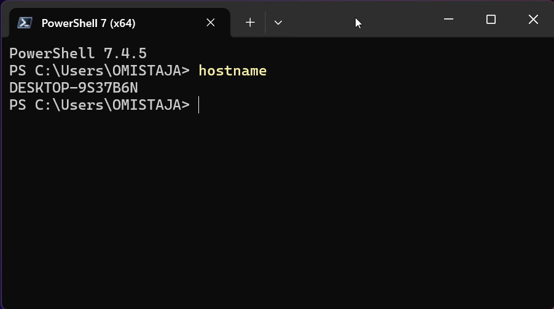

# Introduction

### Here's a small introduction of the programs installed on my computer

## Programs:
1. Powershell core
2. Git
3. VSCode
4. Putty
5. Firefox
6. Greenshot
7. Google drive file stream
8. Google Chrome
9. Notepad++
10. Winscp
11. 7zip
12. Paint.net
13. WinDirStat
14. Zoom
15. Sudo
16. Vmrc
17. VMware Horizon Client
18. Github Desktop
19. Docker Desktop
20. OBS Studio
21. Discord


***To install mentioned programs, run this script in Powershell***

```powershell

choco install powershell-core git vscode putty greenshot notepadplusplus winscp discord 7zip paint.net windirstat zoom sudo vmrc vmware-horizon-client github-desktop obs-studio docker-desktop google-drive-file-stream googlechrome curl powertoys -y

``` 


## Here's a screenshot from my terminal, after running the command "hostname"
